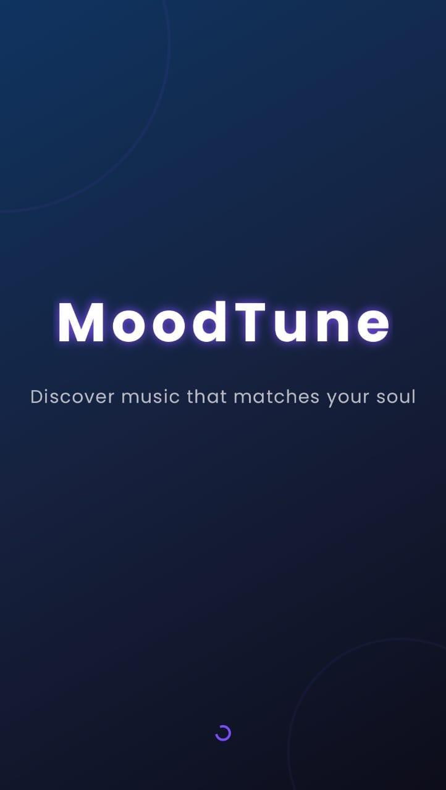
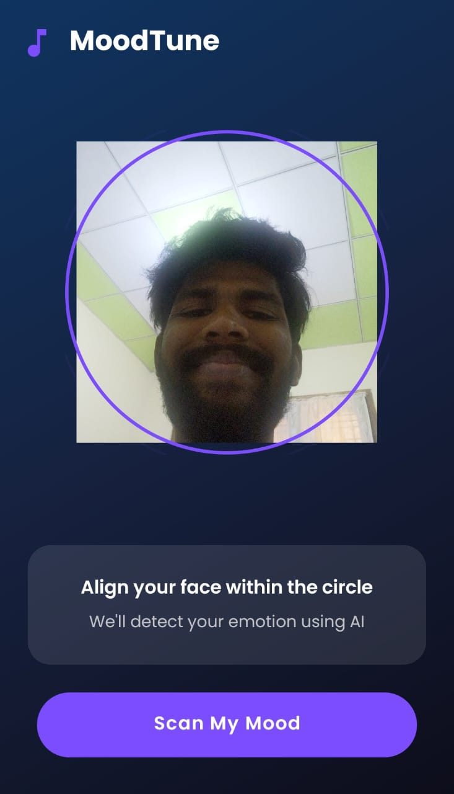
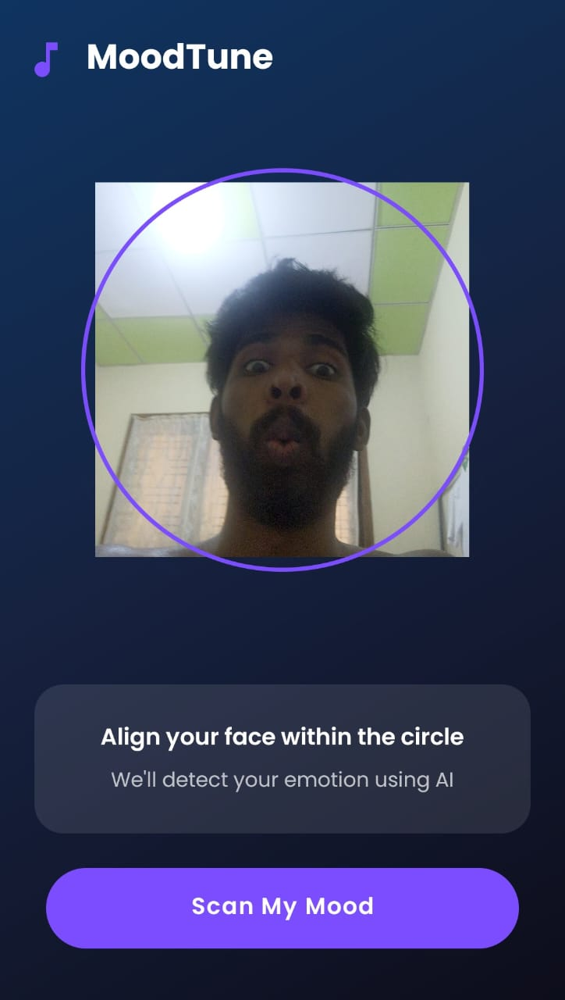
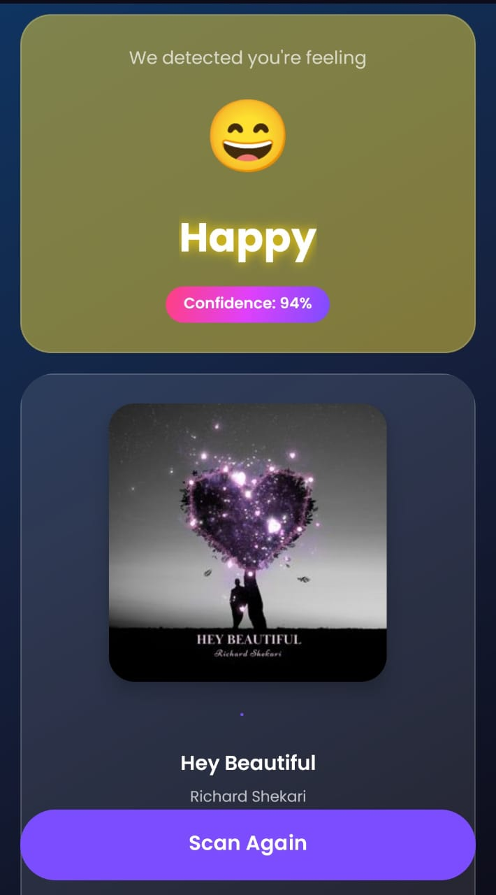
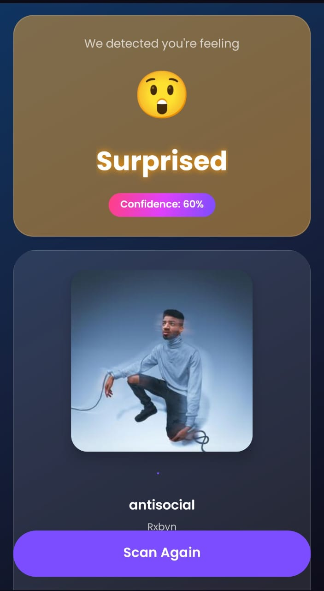
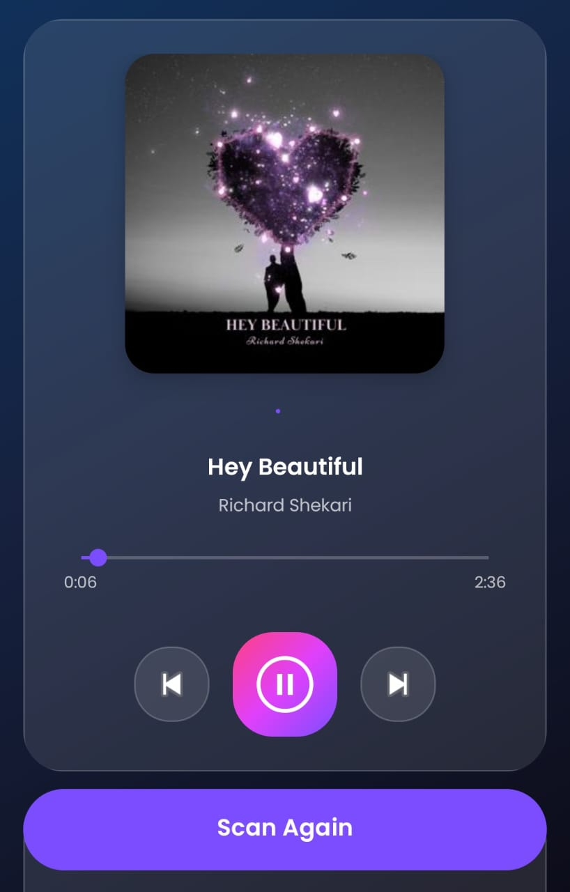
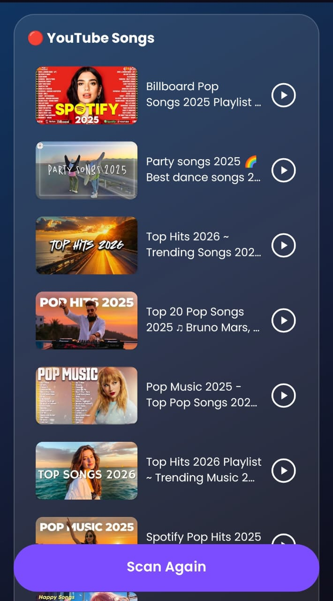

# MoodTune 🎵

**MoodTune** is an intelligent Android application that detects your current emotion using facial recognition and recommends music that perfectly matches your mood. Simply tap the play button to enjoy songs tailored to how you're feeling — whether you're happy, sad, or angry, MoodTune finds the right track for you.

## ✨ Features

*   **Real-time Emotion Detection**: Uses the front camera to scan your face and identify emotions.
*   **AI-Powered Analysis**: Integrates **Google ML Kit** for face detection and a custom **TensorFlow Lite (TFLite)** model for emotion classification.
*   **Smart Music Recommendations**: Connects to music APIs (Jamendo/YouTube) to fetch songs based on the detected mood. Tap the play button to listen to a recommended track, or browse mood-matched YouTube videos and open them directly with a single tap.
*   **Modern UI/UX**: Clean, animated interface built with Material Design components and **Lottie** animations.
*   **MVVM Architecture**: Follows best practices for robust and maintainable code.

## 📱 UI Showcase

<div align="center">

| Splash | Scan Screen | Scan Screen | Result - Happy |
|:---:|:---:|:---:|:---:|
|  |  |  |  |

| Result - Surprised | Music Player | YouTube Songs |
|:---:|:---:|:---:|
|  |  |  |

</div>

## 🛠 Tech Stack

*   **Language**: Java
*   **Architecture**: MVVM (Model-View-ViewModel)
*   **Machine Learning**:
    *   **Google ML Kit**: For high-speed face detection.
    *   **TensorFlow Lite**: For running the custom emotion recognition model on-device.
    *   **Python (TensorFlow/Keras)**: Used for training the CNN model on the FER-2013 dataset.
*   **Networking**: Retrofit 2, OkHttp 3, Gson
*   **UI Components**: CameraX, ViewBinding, Glide, Lottie, Material Components
*   **Build System**: Gradle 8.2

## 🚀 Getting Started

### Prerequisites

*   Android Studio Iguana or newer
*   JDK 17
*   Android Device with a front camera (Emulator with camera support works too)

### Installation

1.  **Clone the repository:**
    ```bash
    git clone https://github.com/Mihiran-Thilakarathna/MoodTune.git
    ```
2.  **Open in Android Studio:**
    *   Launch Android Studio -> `File` -> `Open` -> Select the `MoodTune` folder.
3.  **Sync Gradle:**
    *   Allow Android Studio to download dependencies and sync the project.
4.  **Run the App:**
    *   Connect your Android device or start an emulator.
    *   Click the **Run** button (▶).

## 🧠 Model Training

The app comes with a pre-trained model (`emotion_model.tflite`) in the assets folder. If you want to retrain or improve the model:

1.  **Navigate to the project root.**
2.  **Download the dataset:**
    *   Download `fer2013.csv` from [Kaggle](https://www.kaggle.com/datasets/msambare/fer2013).
    *   Place it in the root directory.
3.  **Install Python dependencies:**
    ```bash
    pip install tensorflow pandas numpy scikit-learn
    ```
4.  **Run the training script:**
    ```bash
    python generate_emotion_model.py
    ```
    *   This will train a CNN model and verify it.
    *   It automatically saves the optimized `emotion_model.tflite` to `app/src/main/assets/`.

## 📂 Project Structure

```
MoodTune/
├── app/
│   ├── src/main/
│   │   ├── java/com/moodtune/app/
│   │   │   ├── data/       # Models & API Responses
│   │   │   ├── network/    # Retrofit Clients & Services
│   │   │   ├── ui/         # Activities (View)
│   │   │   ├── utils/      # Helper classes (FaceAnalyzer, NetworkUtils)
│   │   │   └── viewmodel/  # ViewModels
│   │   ├── assets/         # TFLite model & JSON files
│   │   └── res/            # Layouts, Drawables, Animations
├── screenshots/            # App UI Screenshots
├── generate_emotion_model.py # Python script for model training
└── README.md
```

## 📜 License

This project is open-source and available under the [MIT License](LICENSE).

## 🤝 Contributing

Contributions are welcome! Feel free to submit a Pull Request.

1.  Fork the Project
2.  Create your Feature Branch (`git checkout -b feature/AmazingFeature`)
3.  Commit your Changes (`git commit -m 'Add some AmazingFeature'`)
4.  Push to the Branch (`git push origin feature/AmazingFeature`)
5.  Open a Pull Request

## 📧 Contact

**Mihiran Thilakarathna**
- [GitHub Profile](https://github.com/Mihiran-Thilakarathna)
- [LinkedIn Profile](https://www.linkedin.com/in/mihiran-thilakarathna-9478302a8/)

---
*Made by Mihiran Thilakarathna*
